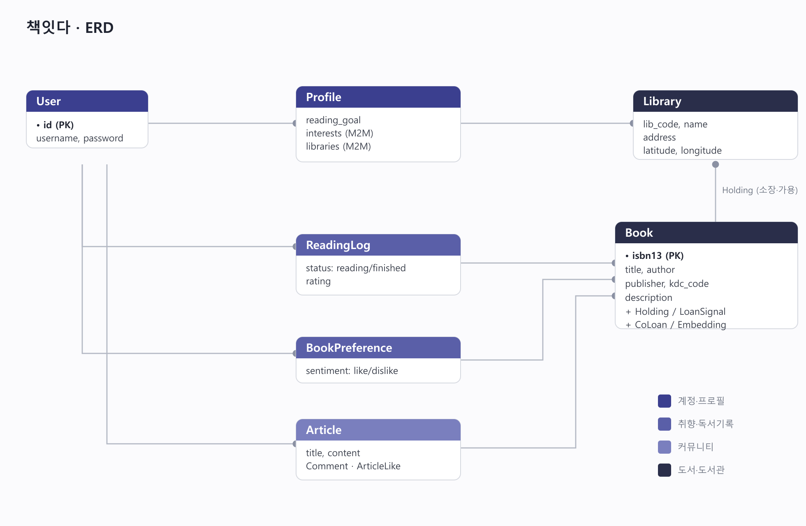
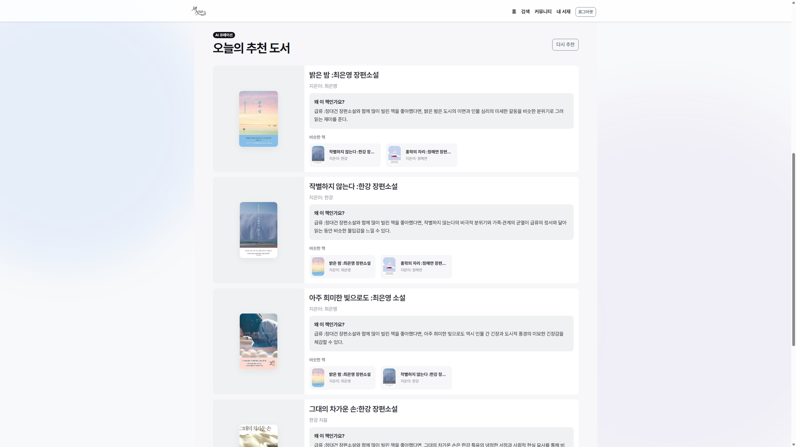
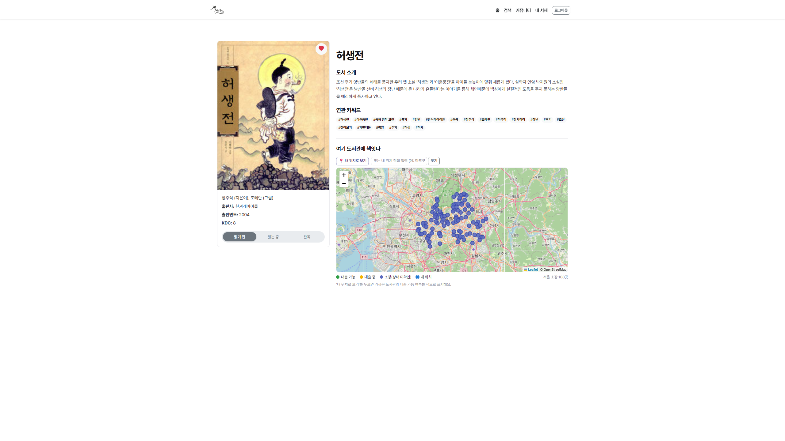
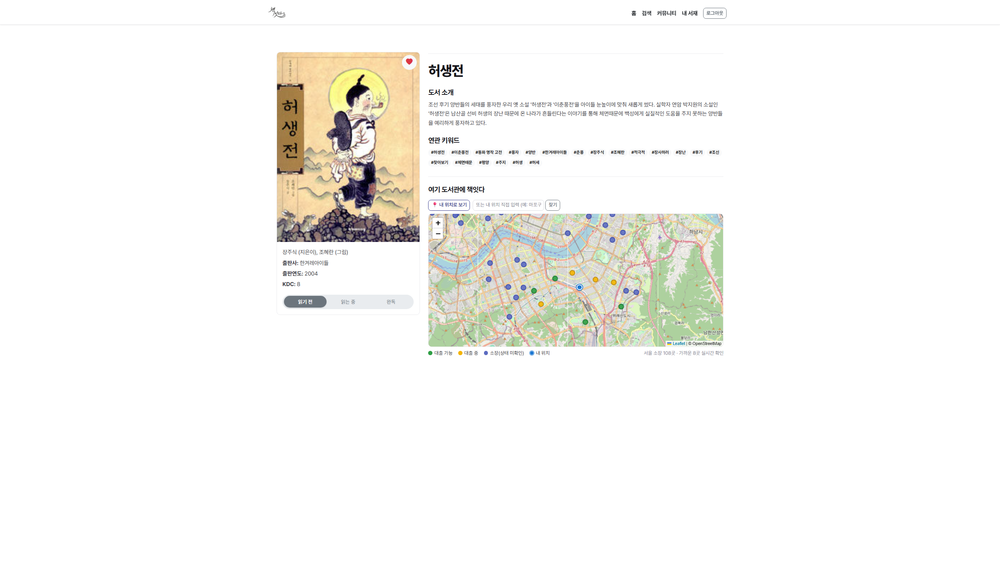
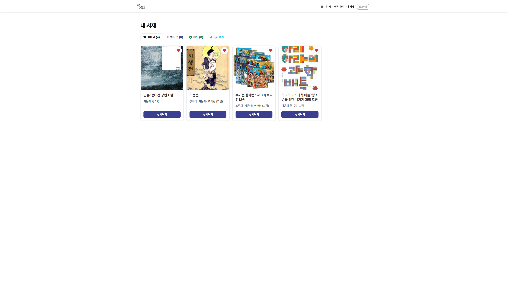
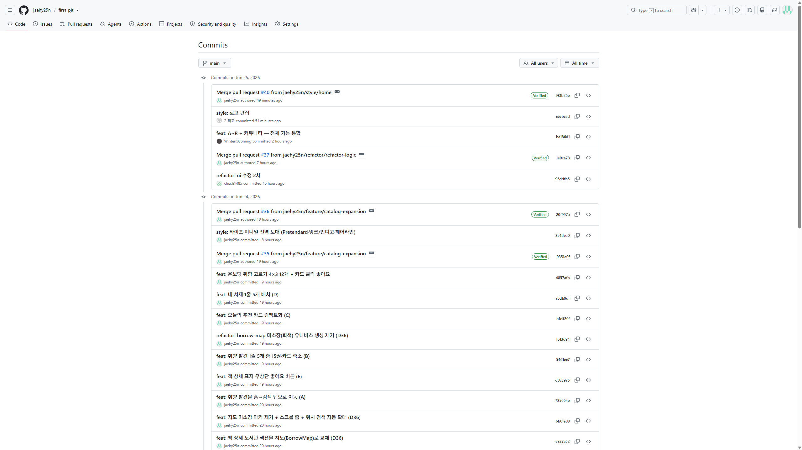

# 책잇다

공공도서관 대출 데이터 기반 도서 추천 웹 서비스입니다.

취향에 맞는 다음 책을 추천하고, 내 주변 도서관에서 지금 빌릴 수 있는지까지 지도로 확인할 수 있습니다.

---

## 팀원 및 업무 분담

| 이름 | 역할 |
|---|---|
| 김재현 | 백엔드 — Django 모델링, DRF API, 추천 엔진, 데이터 수집·적재, 정보나루 연동 |
| 조서형 | 프론트엔드 — Vue SPA, 화면 구성, 커뮤니티, UI 정리 |

---

## 목표 서비스 및 구현 정도

공공도서관 대출 데이터와 LLM을 결합해 사용자 취향 기반 도서를 추천하고, 실제로 빌릴 수 있는 도서관까지 보여주는 것을 목표로 했습니다.

| 기능 | 구현 |
|---|:---:|
| 회원가입 / 로그인 | ✅ |
| 표지픽 온보딩 (취향 수집) | ✅ |
| 근처 도서관 선택 | ✅ |
| 홈 — 오늘의 추천 (LLM + 이유) | ✅ |
| 검색 — 취향 발견 | ✅ |
| 책 상세 — 도서관 지도 | ✅ |
| 책 상세 — 연관 키워드 | ✅ |
| 내 서재 (독서기록 + 통계) | ✅ |
| 커뮤니티 (게시판 + 댓글) | ✅ |
| 비로그인 / 빈상태 / 에러 처리 | ✅ |
| 배포 | ❌ |

---

## 데이터베이스 모델링 (ERD)



---

## 추천 알고리즘

### 후보 생성

사용자가 좋아요를 누르거나 완독한 책을 seed로 삼아 후보를 모읍니다.

- **임베딩 유사도**: GMS `text-embedding-3-small`로 오프라인 계산해둔 1536차원 벡터를 코사인 유사도로 비교해 비슷한 책을 찾습니다.
- **함께 대출(CoLoan)**: 같은 대출 기록에 함께 등장한 책 쌍 점수를 활용합니다.
- **인기 신호**: 정보나루 인기대출(`popular`)과 알라딘 베스트셀러(`bestseller`) 점수를 약하게 가중합니다.
- **가용성 배지**: 선택 도서관 소장 여부(Holding)를 `available / loaned / none`으로 표시합니다.

### LLM 선별

후보 50권을 GMS(`gpt-5-nano`)에 전달해 최종 5권을 고르고 추천 이유를 생성합니다. 사용자가 좋아한 책 제목을 구체적으로 인용하도록 프롬프트를 구성했고, 상투적인 표현은 차단했습니다. LLM 호출이 실패하면 인기순 폴백으로 전환됩니다.

### 실시간 가용성 확인

최종 추천 N권에 대해서만 정보나루 `bookExist` API를 호출해 실제 대출 가능 여부를 업데이트합니다. 전체 후보를 실시간으로 확인하면 API 호출 한도를 초과할 수 있어 보여줄 소수만 확인하는 방식을 택했습니다.

### 취향 발견

온보딩과 검색 탭의 "이런 책도 잇다" 섹션에 사용됩니다. 첫 라운드는 인기·베스트셀러 순 + KDC 버킷별 상한으로 장르를 고르게 섞고, 좋아요를 누를수록 임베딩 이웃으로 좁혀지는 반복정제 방식입니다.

---

## 핵심 기능

**온보딩**: 표지픽 카드(4×3)를 반복정제 방식으로 보여주며 취향을 수집합니다. Geolocation으로 근처 도서관을 찾아 선택할 수 있습니다(서울 355개관, Haversine 거리 계산).

**오늘의 추천**: 로그인 후 홈에서 GMS LLM 기반 맞춤 추천 5권과 각 추천 이유를 표시합니다.

**책 상세 — 도서관 지도**: Leaflet + OSM 지도에 책 소장 도서관 마커를 색상으로 구분해 표시합니다(🟢 대출가능 / 🟡 대출중 / 🔵 소장). "내 위치" 버튼이나 주소 직접 입력(Nominatim)으로 중심을 이동할 수 있습니다.

**내 서재**: 읽는 중 / 완독 슬라이드 토글, 좋아요 목록, 월별 독서 통계 차트를 제공합니다.

**커뮤니티**: 게시글 작성·수정·삭제, 댓글, 좋아요를 지원합니다. 게시글에 책을 연결하면 책 상세에서도 관련 글이 노출됩니다.

---

## 생성형 AI 활용

| 활용 영역 | 도구 |
|---|---|
| 도서 추천 선별 + 이유 생성 | SSAFY GMS (`gpt-5-nano`) |
| 책 임베딩 생성 (유사도 기반 추천·발견) | SSAFY GMS (`text-embedding-3-small`) |
| 백엔드 API·추천 로직·데이터 파이프라인 구현 보조 |
| 프론트엔드 컴포넌트·UI 구현 보조 |

---

## Git 협업

### 브랜치 전략

`main`에 직접 push하지 않고, 작업 단위로 브랜치를 만들어 Pull Request로 머지했습니다.

```
main
├── feature/*  /  feat/*   기능 개발
├── fix/*                  버그 수정
├── refactor/*             리팩토링
├── chore/*                설정·데이터
├── style/*                UI 스타일
└── docs/*                 문서
```

### 커밋 컨벤션

```
feat:     새 기능
fix:      버그 수정
refactor: 기능 변경 없는 코드 개선
chore:    빌드·설정·데이터
style:    UI 스타일
docs:     문서
data:     데이터 수집·적재
```

### 주요 브랜치

| 브랜치 | 내용 |
|---|---|
| `feature/catalog-expansion` | 카탈로그 확장(2153권), 임베딩, 가용성, 지도 |
| `feat/book-embeddings` | GMS 임베딩 + 취향 발견 |
| `feat/multi-library` | 다중 도서관 선택 |
| `feat/merge-likes` | 좋아요/찜 통합 |
| `feat/ux-states` | 빈상태·로딩·에러 처리 |
| `fix/gms-call` | GMS 추천 호출 정상화 |
| `feature/community` | 커뮤니티 |
| `refactor/refactor-logic` | UI 리디자인 (Pretendard, 플로팅 내비) |

---

## 실행 방법

### 백엔드
```
python -m venv venv
.\venv\Scripts\Activate.ps1          # mac/Linux: source venv/bin/activate
pip install -r requirements.txt
copy .env.example .env               # mac/Linux: cp .env.example .env  (값 입력)
python manage.py migrate
python manage.py loaddata interests seed embeddings
python manage.py runserver
```
데모 계정(선택): `python manage.py seed_demo` → demo / demo1234

### 프론트엔드
```
cd frontend
npm install
npm run dev
```

## 환경변수
`.env.example`를 `.env`로 복사해 채운다. `DJANGO_SECRET_KEY`는 필수이고, `LIBRARY_API_KEY`(도서관 가용성)·`GMS_*`(LLM 추천)는 없으면 폴백으로 동작한다.

## 데이터
`fixtures/seed.json`, `fixtures/embeddings.json`에 카탈로그(책 2,153 / 도서관 355)와 임베딩이 들어 있어 `loaddata`로 적재된다.

## 실행 화면

### 홈 — 오늘의 추천



### 온보딩 — 취향 고르기


### 책 상세 — 도서관 지도



### 검색 — 취향 발견


### 내 서재


### 커뮤니티


---

## Git 커밋 내역


